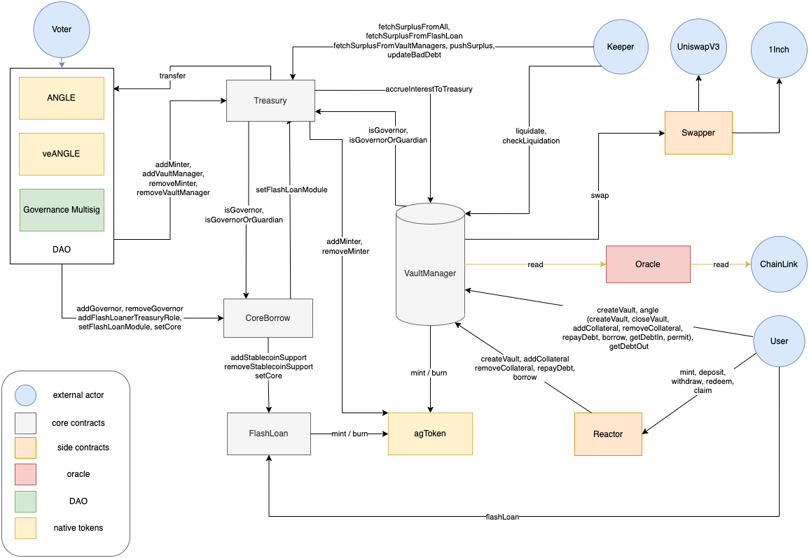

#  Angle Borrowing Module

[](https://github.com/AngleProtocol/borrow-contracts/actions?query=workflow%3ACI)
[](https://docs.angle.money/angle-borrowing-module/borrowing-module)
[](https://developers.angle.money/borrowing-module-contracts/architecture-overview)

## Documentation

### To Start With

Angle is a decentralized stablecoin protocol, designed to be both over-collateralized and capital-efficient. For more information about the protocol, you can refer to [Angle Documentation](https://docs.angle.money).

The protocol is made of different modules, each with their own set of smart contracts. This repo contains the Borrowing module smart contracts.

Smart contracts used to for yield-bearing tokens as collateral assets in the Borrowing module are in a different repository that you can find [here](https://github.com/AngleProtocol/borrow-lpTokens-contracts).

### Resources

- [Documentation](https://docs.angle.money) to understand Angle Protocol's Borrowing Module
- [Developers doc](https://developers.angle.money/borrowing-module-contracts/architecture-overview) to understand how these smart contracts work together work together
- [Whitepaper](https://docs.angle.money/overview/whitepapers) for the module
- [Portal](https://linktr.ee/angleprotocol) of resources for more info about the protocol
- [Angle Protocol related audits](https://docs.angle.money/resources/audits)



### Further Information

For a broader overview of the protocol and its different modules, you can also check [this overview page](https://developers.angle.money) of our developers documentation.

Other Angle-related smart contracts can be found in the following repositories:

- [Angle Core module contracts](https://github.com/AngleProtocol/angle-core)
- [Angle Strategies](https://github.com/AngleProtocol/angle-strategies)
- [Angle Router contracts](https://github.com/AngleProtocol/angle-router)
- [Angle Direct Deposit Modules (or Algorithmic market operations)](https://github.com/AngleProtocol/angle-amo)

### Audits

The contracts of this module have been audited by [Chainsecurity](https://chainsecurity.com/security-audit/angle-protocol-borrowing-module/). The audit reports can be found in the `audits/` folder of this repo.

### Bug Bounty

At Angle, we consider the security of our systems a top priority. But even putting top priority status and maximum effort, there is still possibility that vulnerabilities exist.

We have therefore setup a bug bounty program with the help of Immunefi. The Angle Protocol bug bounty program is focused around our smart contracts with a primary interest in the prevention of:

- Thefts and freezing of principal of any amount
- Thefts and freezing of unclaimed yield of any amount
- Theft of governance funds
- Governance activity disruption

For more details, please refer to the [official page of the bounty on Immunefi](https://immunefi.com/bounty/angleprotocol/).

| Level    |                     |
| :------- | :------------------ |
| Critical | up to USD \$500,000 |
| High     | USD \$20,000        |
| Medium   | USD \$2,500         |

All bug reports must include a Proof of Concept demonstrating how the vulnerability can be exploited to be eligible for a reward. This may be a smart contract itself or a transaction.

### Remarks

#### Cross-module Contracts

Some smart contracts of the protocol are used across the different modules of Angle (like the `agToken` contract) and you'll sometimes see different versions across the different repositories of the protocol.

Here are some cross-module contracts and the repos in which you should look for their correct and latest version:

- [`angle-core`](https://github.com/AngleProtocol/angle-core): All DAO-related contracts (`ANGLE`, `veANGLE`, gauges, surplus distribution, ...), `AngleRouter` contract
- [`borrow-contracts`](https://github.com/AngleProtocol/borrow-contracts): `agToken` contract
- [`angle-strategies`](https://github.com/AngleProtocol/angle-strategies): Yield strategies of the protocol

#### Undeployed Contracts

Some smart contracts in this repo have been developed for research purposes, but have not been audited or deployed in production.

This is notably the case of the contracts in the `contracts/reactor/` folder which should be dismissed if you're auditing the protocol.

#### Error Messages

Some smart contracts use error messages that are encoded as numbers rather. Conversion from numbers to error messages can be found in `errorMessages.json`.

## Setup

To install all the packages needed to run the tests and scripts, run:

```shell
yarn
forge i
```

### Setup Foundry

Some scripts and tests run on Foundry:

```bash
curl -L https://foundry.paradigm.xyz | bash
source /root/.zshrc
# or, if you're under bash: source /root/.bashrc
foundryup
```

To install the standard library:

```bash
forge install foundry-rs/forge-std
```

To update libraries:

```bash
forge update
```

**If you don’t want to install Rust and Foundry on your computer, you can use Docker**
Image is available here [ghcr.io/foundry-rs/foundry](http://ghcr.io/foundry-rs/foundry).

```bash
docker pull ghcr.io/foundry-rs/foundry
docker tag ghcr.io/foundry-rs/foundry:latest foundry:latest
```

To run the container:

```bash
docker run -it --rm -v $(pwd):/app -w /app foundry sh
```

Then you are inside the container and can run Foundry’s commands.

### Setup environment

Create a `.env` file from the template file `.env.example`.
If you don't define URI and mnemonics, default mnemonic will be used with a brand new local hardhat node.

## Contracts usage

### Compilation

```shell
yarn hardhat:compile
```

### Testing

**With Hardhat**:

```shell
yarn hardhat:test
```

Defaults with `hardhat` network, but another network can be specified with `--network NETWORK_NAME`.

A single test file or a glob pattern can be appended to launch a reduced set of tests:

```shell
yarn hardhat:test tests/vaultManager/*
```

**With Foundry:**

You can run tests as follows:

```bash
forge test -vvvv --watch
forge test -vvvv --match-path tests/foundry/vaultManager/VaultManager.t.sol
forge test -vvvv --match-test "testAbc*"
```

You can also list tests:

```bash
forge test --list
forge test --list --json --match-test "testXXX*"
```

### Scripts

`yarn hardhat run PATH_TO_SCRIPT`

Some scripts require to fork mainnet. To do so, you must first ensure that the `ETH_NODE_URI_FORK` in `.env` is pointing to an archival node (note: Alchemy provides this functionnality for free but Infura doesn't).

Then, uncomment `blockNumber` in the `hardhat` network definition inside `hardhat.config.ts` to boost node speed.
Then run:

```shell
FORK=true yarn hardhat run PATH_TO_SCRIPT
```

### Coverage

We try to keep our contract's code coverage above 99%. All contract code additions should be covered by tests (locally and in mainnet-fork) before being merged and deployed on mainnet.

To run code coverage:

**With Hardhat:**

```shell
yarn coverage
```

A subgroup of tests can be run by specifying `--testfiles "path/to/tests/*.ts"`.

If coverage runs out of memory, you can export this in your env and retry:

```shell
export NODE_OPTIONS=--max_old_space_size=4096
```

**With Foundry:**

We recommend the use of this [vscode extension](ryanluker.vscode-coverage-gutters).

```bash
yarn foundry:coverage
```

### Troubleshooting

If you have issues running tests or scripts, you can try to regenerate contracts typescript bindings by running

```shell
yarn generate-types-from-abis
```

You can also delete `node_modules`, `cache`, and then re-install dependancies with `yarn install --frozen-lockfile`.
